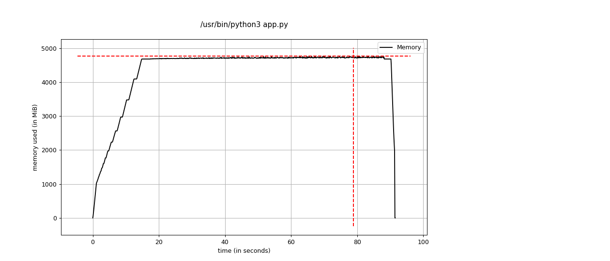
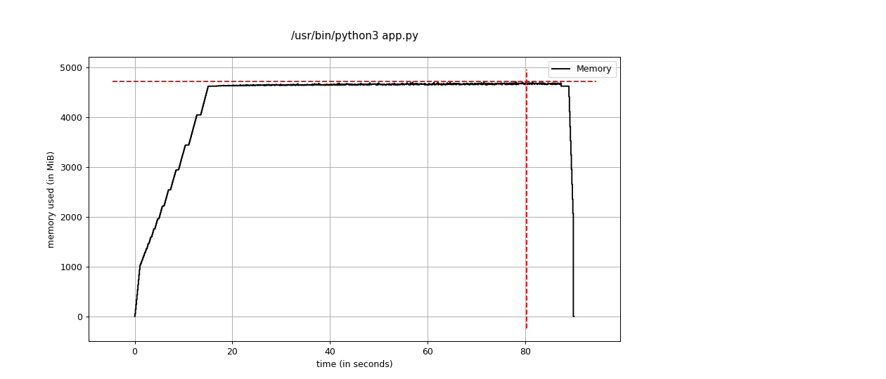

# TweetyTerminal
1ο Project Εργαλείων Ανάπτυξης Λογισμικού και Προγραμματισμού Συστημάτων


Users :
  - Ηλίας aka TheStopDefiler -> Dev
  - Γιώργος aka GeorgeAngel1998 -> Kenny Loggins
  - Νίκος aka NCH-dev -> Refactoring
  - Μάριος aka IamSynthetiC81 -> Unit Testing
  - Γιώργος aka Ghost -> Profiling 
---

# README for Testing

## Tests

The tests we produced test each function and its core functionality:
- `test_loadTweets()`
- `test_update_tweet()`
- `test_create_tweet()`
- `test_save_to_disk()`
- `test_delete_tweet()`

### SetUp()

We load the data into an array that each test used. This acts as a reset between each test.

### Test_loadTweets()

For this function we assert that all tweets have been loaded, and whether they have been loaded correctly

### test_update_tweet()

We replace each tweets text with the string `Tweet + {index}` and we assert that those changes reflect into the array.

### test_create_tweet()

We create some new tweets and assert that they have been added corectly into the array.

### test_save_to_disk()

We update each tweet with the string `Tweet + {index}` and save it into the disk. We then load the file into another array and assert each tweet has come through correctly.

### test_delete_tweet()

We keep deleting the first tweet and assert the next one took its place aswell as that the list size was decremented correctly.

---

# README for Profiling

The recources we are profiling are :
- Memory Allocation
- Time allocation 

While using the app, and while looking at the code, it is obvious that the majority of recources are been taken by the `loadTweet` and `saveToDisk` functions. So we will focus on those.

Efforts where made to improve the loading of the tweets through a variety of JSON parsers, but most did not work, or offered no major advantage.

We found that RapidJSON offered better results while been easy to implement, and therefore we will compare it to pythons default JSON parser.

## Time allocation

As a benchmark we are loading the program, and press 'x' to call `SaveToDisk()`. 
Our profilers are memory_profiler and cProfile. all we need to do is run 'profiling.py' and the reports will automaticaly be created in the `prof` folder.

### JSON vs RapidJSON

for this test we are simply loading all the tweets from the file, and saving them in another.

**Disclaimer** **:** We are not saving the files with RapidJSON as it is prohibitly slow. 

#### JSON
```log
  3597716 function calls in 114.504 seconds

   Ordered by: cumulative time

   ncalls  tottime  percall  cumtime  percall filename:lineno(function)
        1    0.000    0.000  114.504  114.504 {built-in method builtins.exec}
        1    0.000    0.000  114.504  114.504 <string>:1(<module>)
        1    0.033    0.033  114.504  114.504 /home/marios/TweetyTerminal/app.py:223(main)
        1    0.000    0.000   90.638   90.638 /home/marios/TweetyTerminal/app.py:149(terminalUI)
        1    0.003    0.003   74.835   74.835 /home/marios/TweetyTerminal/app.py:162(menu)
        1   73.853   73.853   74.832   74.832 /home/marios/TweetyTerminal/app.py:105(saveToDisk)
        1    1.197    1.197   23.832   23.832 /home/marios/TweetyTerminal/app.py:15(loadTweets)
   299999    3.046    0.000   21.104    0.000 /usr/lib/python3.10/json/__init__.py:299(loads)
   299999    1.566    0.000   17.917    0.000 /usr/lib/python3.10/json/decoder.py:332(decode)
   299999   16.002    0.000   16.002    0.000 /usr/lib/python3.10/json/decoder.py:343(raw_decode)
        1   15.803   15.803   15.803   15.803 {built-in method builtins.input}
        1    0.618    0.618    1.498    1.498 {method 'readlines' of '_io._IOBase' objects}
    10001    0.143    0.000    0.979    0.000 /usr/lib/python3.10/json/__init__.py:183(dumps)
   118849    0.362    0.000    0.880    0.000 /usr/lib/python3.10/codecs.py:319(decode)
    10001    0.076    0.000    0.836    0.000 /usr/lib/python3.10/json/encoder.py:182(encode)
    10001    0.751    0.000    0.751    0.000 /usr/lib/python3.10/json/encoder.py:204(iterencode)
   118849    0.518    0.000    0.518    0.000 {built-in method _codecs.utf_8_decode}
   599998    0.238    0.000    0.238    0.000 {method 'match' of 're.Pattern' objects}
   299999    0.106    0.000    0.106    0.000 {method 'startswith' of 'str' objects}
   599998    0.070    0.000    0.070    0.000 {method 'end' of 're.Match' objects}
   300000    0.042    0.000    0.042    0.000 {built-in method builtins.len}
   320001    0.042    0.000    0.042    0.000 {built-in method builtins.isinstance}
   299999    0.034    0.000    0.034    0.000 {method 'append' of 'list' objects}
    10001    0.002    0.000    0.002    0.000 {method 'join' of 'str' objects}
        2    0.000    0.000    0.000    0.000 {built-in method io.open}
        2    0.000    0.000    0.000    0.000 {built-in method builtins.print}
        2    0.000    0.000    0.000    0.000 {method '__exit__' of '_io._IOBase' objects}
        1    0.000    0.000    0.000    0.000 {method 'close' of '_io.TextIOWrapper' objects}
        1    0.000    0.000    0.000    0.000 /usr/lib/python3.10/codecs.py:186(__init__)
        1    0.000    0.000    0.000    0.000 /usr/lib/python3.10/codecs.py:309(__init__)
        1    0.000    0.000    0.000    0.000 {method 'split' of 'str' objects}
        1    0.000    0.000    0.000    0.000 {method 'strip' of 'str' objects}
        1    0.000    0.000    0.000    0.000 /usr/lib/python3.10/codecs.py:260(__init__)
        1    0.000    0.000    0.000    0.000 {method 'disable' of '_lsprof.Profiler' objects}


```
#### RapidJSON
```log
Tue Nov 29 00:19:54 2022    prof/profiling.prof

         897724 function calls in 105.413 seconds

   Ordered by: cumulative time

   ncalls  tottime  percall  cumtime  percall filename:lineno(function)
        1    0.000    0.000  105.413  105.413 {built-in method builtins.exec}
        1    0.000    0.000  105.413  105.413 <string>:1(<module>)
        1    0.031    0.031  105.413  105.413 /home/marios/TweetyTerminal/app.py:223(main)
        1    0.000    0.000   86.229   86.229 /home/marios/TweetyTerminal/app.py:149(terminalUI)
        1    0.002    0.002   76.250   76.250 /home/marios/TweetyTerminal/app.py:162(menu)
        1   75.275   75.275   76.248   76.248 /home/marios/TweetyTerminal/app.py:105(saveToDisk)
        1    1.198    1.198   19.152   19.152 /home/marios/TweetyTerminal/app.py:15(loadTweets)
   299999   16.426    0.000   16.426    0.000 {built-in method rapidjson.loads}
        1    9.979    9.979    9.979    9.979 {built-in method builtins.input}
        1    0.625    0.625    1.493    1.493 {method 'readlines' of '_io._IOBase' objects}
    10001    0.145    0.000    0.966    0.000 /usr/lib/python3.10/json/__init__.py:183(dumps)
   118849    0.350    0.000    0.868    0.000 /usr/lib/python3.10/codecs.py:319(decode)
    10001    0.075    0.000    0.821    0.000 /usr/lib/python3.10/json/encoder.py:182(encode)
    10001    0.736    0.000    0.736    0.000 /usr/lib/python3.10/json/encoder.py:204(iterencode)
   118849    0.518    0.000    0.518    0.000 {built-in method _codecs.utf_8_decode}
   299999    0.035    0.000    0.035    0.000 {method 'append' of 'list' objects}
    20002    0.008    0.000    0.008    0.000 {built-in method builtins.isinstance}
        2    0.007    0.003    0.007    0.003 {built-in method io.open}
    10001    0.002    0.000    0.002    0.000 {method 'join' of 'str' objects}
        1    0.000    0.000    0.000    0.000 {built-in method builtins.print}
        2    0.000    0.000    0.000    0.000 {method '__exit__' of '_io._IOBase' objects}
        1    0.000    0.000    0.000    0.000 {method 'close' of '_io.TextIOWrapper' objects}
        1    0.000    0.000    0.000    0.000 /usr/lib/python3.10/codecs.py:309(__init__)
        1    0.000    0.000    0.000    0.000 /usr/lib/python3.10/codecs.py:186(__init__)
        1    0.000    0.000    0.000    0.000 {method 'split' of 'str' objects}
        1    0.000    0.000    0.000    0.000 {method 'strip' of 'str' objects}
        1    0.000    0.000    0.000    0.000 /usr/lib/python3.10/codecs.py:260(__init__)
        1    0.000    0.000    0.000    0.000 {built-in method builtins.len}
        1    0.000    0.000    0.000    0.000 {method 'disable' of '_lsprof.Profiler' objects}


```

We can see that there is a small time advantage when loading files with the RapidJSON.

## Memory Allocation

For this benchmark we are again loading all the tweets, and then save them again into a file. We execute this through `mprof run app.py` and when the program exits we plot the results with `mprof plot`.

And also we run pythons `line_profiler` on the two functions.
```Python
python3 -m memory_profiler app.py
```

### JSON Results

```
Line #    Mem usage    Increment  Occurrences   Line Contents
=============================================================
    14   22.859 MiB   22.859 MiB           1   @profile
    15                                         def loadTweets(path: str = PATH) -> list:
    16                                             """
    17                                             Load tweets from the specified path and return them
    18                                             :param path: Path to the json file containing the tweets
    19                                             :return:  Returns a list of tweets
    20                                             """
    21   22.859 MiB    0.000 MiB           1       array = []
    22 4680.930 MiB    0.000 MiB           2       with open(path, 'r') as f:
    23 1020.230 MiB  997.371 MiB           1           lines = f.readlines()
    24 4680.930 MiB    0.000 MiB      300000           for i, line in enumerate(lines):
    25 4680.930 MiB    0.000 MiB      299999               if TWEET_LIMIT is not None and i == TWEET_LIMIT:
    26                                                         break
    27                                         
    28 4680.930 MiB 3580.191 MiB      299999               tweet = json.loads(line)
    29 4680.930 MiB   80.508 MiB      299999               array.append(tweet)
    30 4680.930 MiB    0.000 MiB           1           f.close()
    31                                         
    32                                             global TweetsSize
    33 4680.930 MiB    0.000 MiB           1       TweetsSize = len(array)
    34                                         
    35 4680.930 MiB    0.000 MiB           1       return array

Filename: app.py

Line #    Mem usage    Increment  Occurrences   Line Contents
=============================================================
   105 4678.664 MiB 4678.664 MiB           1   @profile
   106                                         def saveToDisk(path: str = 'output.json', tweets=None) -> None:
   107                                             """
   108                                             Saves the specified list of tweets into the specified path
   109                                             :param path: Name and path of the file to be created or saved on.
   110                                             :param tweets: List of tweets. By default, '~tweetArray' is used.
   111                                             """
   112 4678.664 MiB    0.000 MiB           1       if tweets is None:
   113 4678.664 MiB    0.000 MiB           1           tweets = tweetArray
   114                                         
   115 4711.828 MiB  -30.832 MiB           2       with open(path, "w") as f:
   116 4678.664 MiB    0.000 MiB           1           final = ""
   117 4742.660 MiB -107162.043 MiB       10001           for i, line in enumerate(tweets):
   118 4742.660 MiB -107162.043 MiB       10001               tweet = json.dumps(line)
   119 4742.660 MiB -107162.043 MiB       10001               if i == 10000: return
   120 4742.660 MiB -107098.047 MiB       10000               final = final + "\n" + tweet
   121                                                 f.write(final)
   122                                                 f.close()
```
### RapidJSON Results

.

---

RapidJSON was prohibitely slow when SaveToDisk() was called so we do not use it for that.

```
Filename: app.py

Line #    Mem usage    Increment  Occurrences   Line Contents
=============================================================
    14   22.766 MiB   22.766 MiB           1   @profile
    15                                         def loadTweets(path: str = PATH) -> list:
    16                                             """
    17                                             Load tweets from the specified path and return them
    18                                             :param path: Path to the json file containing the tweets
    19                                             :return:  Returns a list of tweets
    20                                             """
    21   22.766 MiB    0.000 MiB           1       array = []
    22 4622.043 MiB    0.000 MiB           2       with open(path, 'r') as f:
    23 1020.145 MiB  997.379 MiB           1           lines = f.readlines()
    24 4622.043 MiB    0.000 MiB      300000           for i, line in enumerate(lines):
    25 4622.043 MiB    0.000 MiB      299999               if TWEET_LIMIT is not None and i == TWEET_LIMIT:
    26                                                         break
    27                                         
    28 4622.043 MiB 3516.395 MiB      299999               tweet = rapidjson.loads(line)
    29 4622.043 MiB   85.504 MiB      299999               array.append(tweet)
    30 4622.043 MiB    0.000 MiB           1           f.close()
    31                                         
    32                                             global TweetsSize
    33 4622.043 MiB    0.000 MiB           1       TweetsSize = len(array)
    34                                         
    35 4622.043 MiB    0.000 MiB           1       return array
```
### Results
We see RapidJSON also has a negligable advantage in memory allocation when comparing the lines `tweet = rapidjson.loads(line)` vs `tweet = json.loads(line)` in line 28 for each data group.

With this in mind we changed the parser from JSON to RapidJSON, but for storing data, we are still using JSON as RapidJSON would not complete in a reasonable time.
